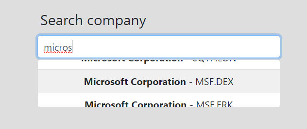

# Alpha Advantage <small> by Samuele Bernardi </small>

## Overview
This project provides real time marketing data based on the company you want to search for.
## API
To retrieve all the data we use the [Alpha Vantage API](https://www.alphavantage.co/documentation/). This API provides you real time marketing data with a request by company, or all the possible companies from a bunch of letters making possible the autocomplete search in this project.
## Search Endpoint
This functionality allows you to type a bunch of letters and find all the companies that start with that string, so we can provide you all the possible companies.
## Example
You can type micros to find Microsoft Corporation

## Chart
You can also see a visual representation of the company trend with a chart of the montlhy close value, year by year. You can choose between **line** and bar **chart**.

This is made trought the [Chart.js tool](https://www.chartjs.org/).

## Location
This functionality allows you to see in a Google map the location of the headquarters of the selected company. This is made throught the [Google maps API](https://developers.google.com/maps?hl=en).

## People
[@BernardiSamuele](https://github.com/bernardisamuele)
